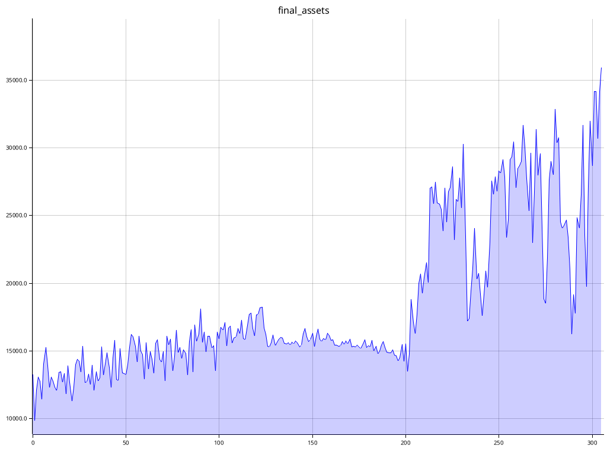
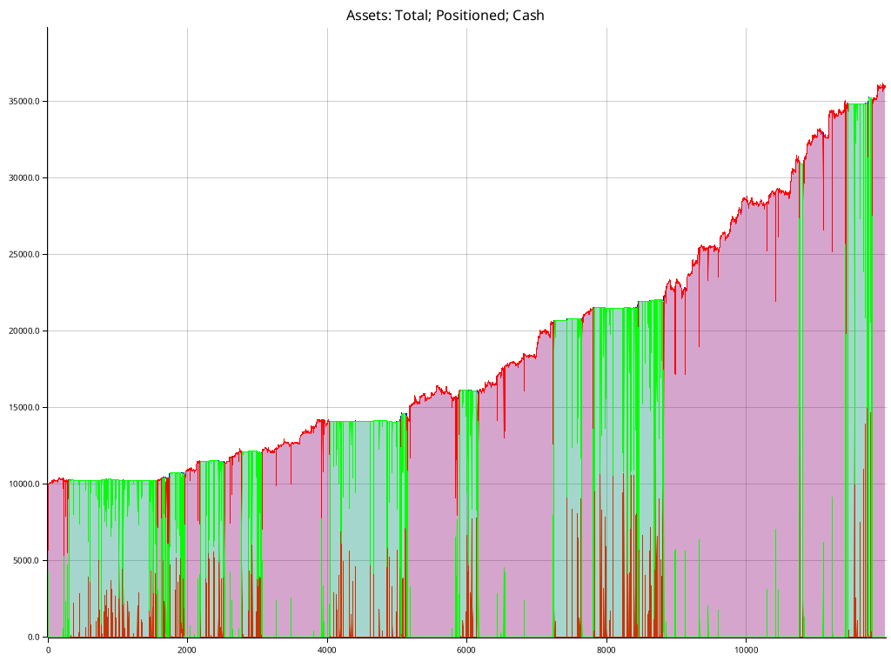
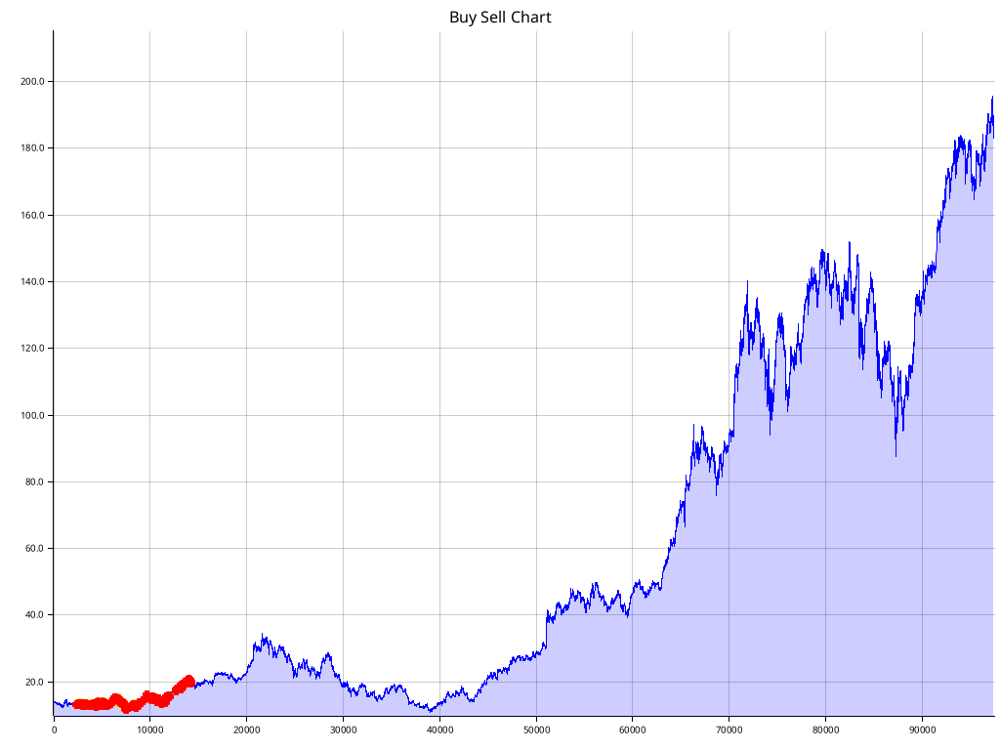

# Trading bot 0

There are many trading bots and strategies in this repo.

## Project Structure

- `src/torch/` high-performance high-results torch RL model
- `src/agents/` and `src/strategies/` programmatic strategies with genetic algorithm training
- `src/burn/` burn model, abandoned due to poor performance
- `training/` training episodes (`gens/`) and metadata (`data/`)
- `weights/` trained or partially trained model schemas

## Programmatic Strategies with Genetic Algorithm optimization

- `src/agents/` and `src/strategies/` a few different strategies with parameters optimized using genetic algorithm, sees significant improvement over training
- Interesting research project but not designed for or expecting significant results

### Single ticker (NVDA) training results

|           |
|:--------------------------------------------------------------------------------------------------------------------------------:|
| *Total assets doubling from $10,000 -> $20,000 over the course of a year using one of the homemade strategic trading algorithms* |

## PPO Trading Agent

Multi-asset trading bot using deep RL (PPO) and historical price data.

- `src/torch/` using tch-rs, model derives from their RL example / openAI's PPO implementation with heavy modifications and additions
- drastically outperforms the programmatic strategies with comparable training time
- Performs exceptionally well when trained sufficiently (thousands of epochs)

### Architecture

- Continuous action space for position sizing [-1, 1] implicit sell/buy/hold and direction (short term memory/goal setting) for each ticker
- ConvNeXt-inspired Conv layers, depthwise-separable blocks for price delta % inputs
- 4-head self-attention learn inter-assret correlations
- Separate FC paths after shared conv features for actor and critic independent policy/value optimization
- Inputs price delta %s from current and previous time steps, intention to support more inputs such as news and social sentiment scores per-ticker and for economy

### Features

- Can trade a single ticker or multiple tickers simultaneously, balancing a portfolio
- Can train and infer on some consumer hardware, needs ~12GB VRAM (I use an RTX 5090 with good success)
- Built to use the IBKR API to download historical data for training
- Intention to do live trading / paper trading with IBKR API

### Single ticker (NVDA) training results

| NVDA Performance                                                     |
|:--------------------------------------------------------------------:|
|  |
|         |
|       |

Thanks to [rust-ibapi](https://github.com/wboayue/rust-ibapi) and its contributors for making this possible