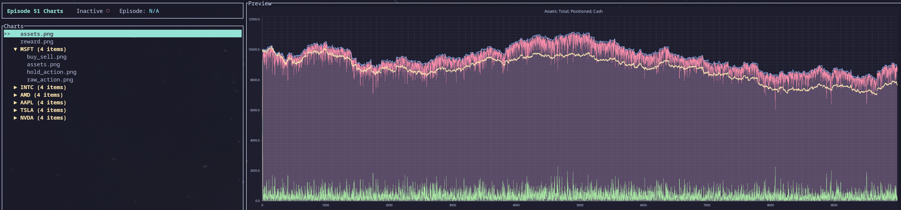
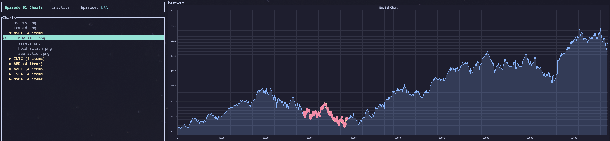
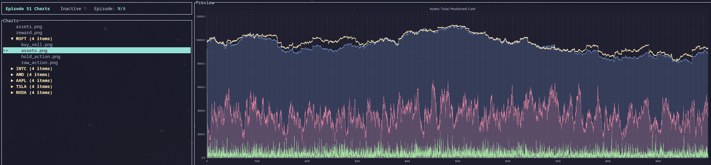
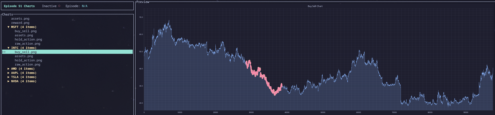
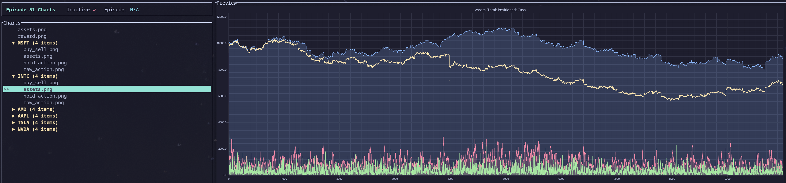

# Trading bot 0

## Monorepo Members

- `trading_bots/` the various trading bots, most notably the `torch/` RL model
- `tui/` control and data viewing for training and inference, designed for the torch RL model
- `shared/` shared code between the members
- `report_cli/` CLI for debugging training and inference results

## Usage

The default training path is **TimeXer OHLC Segment**, using upstream-style dense
segment prediction and plain MSE across the eligible ticker universe. Each window
contains one ticker's own history and future targets. Run `train-timexer-segment`;
`--ticker SYMBOL` optionally restricts the universe. Defaults are 6,000 historical
bars, uniform 16-bar patches, 192 future OHLC bars, and batch size 256 with
NorMuon using Polar Express; embeddings and the output head use AdamW. A full epoch covers each eligible target bar once, including masked tails.
Held-out previews and transparent candle overlays update every 1,000 steps.
See [the model and benchmark protocol](docs/timexer_segment.md).
The earlier probabilistic variant remains available as `train-timexer`; its
[comparison protocol](docs/single_ticker_timexer.md) remains separate. Existing
models retain their explicit commands. Hardware throughput is measured separately
from forecasting accuracy; the new default has not yet established an accuracy
improvement over the existing models.

The supported ML toolchain is declared in `.pytorch-version`. Install and verify it,
then run ML builds through the validating launcher:

```bash
./setup-fa4.sh
./torch-env.sh check
./torch-env.sh cargo check -p trading_bot_0
./torch-env.sh cargo run -p benchmarks --release
./trading_bots/run-release-cuda.sh train
./torch-env.sh ldd target/release/trading_bot_0
```

The categorical world-model pretrainer remains the `pretrain` command. The maintained
c277 MSE-JEPA/LeJEPA model is an isolated path with its own checkpoints and report family:

```bash
./trading_bots/run-release-cuda.sh pretrain
./trading_bots/run-release-cuda.sh pretrain-mse-jepa --run mse_jepa_attached
# Optional matched ablation; attached emission gradients are the measured default.
./trading_bots/run-release-cuda.sh pretrain-mse-jepa \
  --emission-gradient detached --run mse_jepa_detached
./trading_bots/run-release-cuda.sh fit-mse-jepa-readouts \
  --weights training/runs/mse_jepa_attached/weights/mse_jepa.ot \
  --run mse_jepa_attached_raw_fitted
./trading_bots/run-release-cuda.sh fit-mse-jepa-readouts \
  --weights training/runs/mse_jepa_attached/weights/mse_jepa_tail_ema.ot \
  --run mse_jepa_attached_ema_fitted
./trading_bots/run-release-cuda.sh evaluate-mse-jepa-rollout \
  --weights training/runs/mse_jepa_attached_raw_fitted/weights/mse_jepa_fitted.ot \
  --run mse_jepa_attached_rollout
```

`pretrain-mse-jepa` uses the mmap bar corpus, a fixed 6,000-bar context, and the
LeWM future-latent SIGReg default `--lambda-sigreg 0.09`. Each token uses only bars
`t-1` and `t`, with this fixed seven-value order:

1. `ln(open[t] / close[t-1])` (gap)
2. `ln(close[t] / open[t])` (body)
3. `ln(high[t] / max(open[t], close[t]))` (upper wick)
4. `ln(min(open[t], close[t]) / low[t])` (lower wick)
5. `sqrt(max(0.5 * ln(high[t] / low[t])^2 - (2 * ln(2) - 1) * body^2, 0))`
   (Garman–Klass volatility)
6. `ln(volume[t] / volume[t-1])` when both volumes are finite and positive, otherwise zero
7. A presence flag for that valid volume transition

High and low are repaired to contain finite positive current open and close. Invalid
current open or close zeros the five price features without suppressing a valid volume
transition; invalid previous close zeros only the gap. Fixed feature scales are
`[0.004, 0.002, 0.002, 0.002, 0.002, 0.5, 1.0]`.

Core training keeps the deployed `lejepa_emission` online. Emission CE shapes causal
beliefs by default; `--emission-gradient detached` is retained only for matched ablations
and stops that CE-to-belief edge while leaving the head trainable. There is no online token
probe, probe loss, probe optimizer update, or moving-representation probe metric.

Readouts are selected only by the second-stage `fit-mse-jepa-readouts` command. It requires
an authenticated core checkpoint with `completed_steps == planned_steps`, freezes the
complete raw or tail-EMA backbone, resets the entire deployed emission and a separately
constructed same-time token probe, and enforces the official recipe exactly: 4,096 AdamW
updates, batch 8, 4,096 deterministic aligned token rows per update, eight validation
windows, seed `0x524541444f555431`, learning rate 3e-4, betas 0.9/0.999, weight decay 0.01,
and epsilon 1e-8. Noncanonical fit flags are rejected rather than producing an unofficial
checkpoint that could later be mistaken for an endpoint. Only training data is optimized.
The validation panel is evaluated once after fitting; its NLLs and the exact recipe/source
hashes are written into the registered `mse_jepa_posthoc_readout.report.bin` contract.

Only authenticated two-stage-readout-v13 bundles (format 14) with this exact feature layout,
scale, gradient arm, source readout, and fit lineage are accepted. Every core records and
authenticates a fresh-init origin: training seed and batch, resolution/min-bars, exact split
bounds and whether they were pinned or derived, full corpus fingerprint, and a deterministic
digest of all scoring-relevant `BarSupports` geometry/content. Posthoc fitting and rollout
must reproduce that dataset/support origin exactly. Core `mse_jepa.ot` and
`mse_jepa_tail_ema.ot` files are not rollout endpoints: official horizon rollout requires a
canonical `mse_jepa_fitted.ot` or `mse_jepa_tail_ema_fitted.ot`, and also verifies that the
inherited fit report's source hashes and recipe equal checkpoint provenance. Raw and
tail-EMA sources are fitted independently; heads are never transferred between them.
Attached and detached arms are matchable from their authenticated origins except for their
declared gradient mode.

Training uses a disjoint, epoch-rotated 6,000-target tiling and consumes the final short
minibatch instead of dropping it. The DBWM-specific NorMuon/AdamW recipe keeps the first pass
at peak learning rate, cools only over the final planned pass, and uses Polar Express
orthogonalization without gradient accumulation. The canonical `mse_jepa.ot` is the raw core;
`mse_jepa_tail_ema.ot` is the separately authenticated 60% late-EMA core. Their paired
fixed-panel comparison is written to `mse_jepa_tail_ema.report.bin`.

An optional LLM baseline contributes an NLL gap only when its authenticated hard/raw scoring
semantics and complete `BarSupports` digest exactly equal the MSE-JEPA support. Rollout uses
one deterministic RNG stream per validation window for both models, so outputs are bit-exact
across `--window-chunk` values. The knob is retained only as an iteration-grouping compatibility
control; windows are deliberately evaluated individually rather than in a faster GPU batch,
because batch-shaped global CUDA RNG draws cannot provide the required stream invariance.
Both registered rollout reports carry the endpoint hashes, arm/readout, split/corpus/support
identity, seed, window/sample budget, flow integration steps, horizons, and chunk setting in
their authenticated constants series so matched-arm comparisons cannot silently mix panels.

The launcher rejects mismatched PyTorch/CUDA builds before Cargo starts. ML binaries
embed the matching wheel's library directory so normal execution does not depend on
`LD_LIBRARY_PATH`; the `ldd` check deliberately clears that variable while validating
the binary's actual resolution.

It's recommended to use the `tui/` to start training or inference, or to view training or inference data. It's recommended to begin training/inference from inside the tui using the controls it provides so that it can show logs and track episodes correctly.

```rust
cd tui && cargo run --release
```

## Project Structure

- `src/torch/` high-performance high-results torch RL model
- `src/agents/` and `src/strategies/` programmatic strategies with genetic algorithm training
- `src/burn/` burn model, abandoned due to poor performance
- `training/` training episode reports (`gens/`) and metadata (`data/`)
- `weights/` trained or partially trained model schemas
- `infer/` inference reports and metadata

## PPO Trading Agent

Multi-asset trading bot using deep RL (PPO) and historical price data.

- `src/torch/` using tch-rs, model derives from their RL example / SB3 PPO implementation with heavy modifications mentioned below
- drastically outperforms the programmatic strategies with comparable training time
- Performs exceptionally well when trained sufficiently (thousands of epochs)

### Notable Architecture Implementations

- 1.8M parameters
- GQA-based temporal attention stack with streamed prefix/suffix cache for `uniform-stream`
- Continuous action space for position sizing [-1, 1] implicit sell/buy/hold and direction (short term memory/goal setting) for each ticker
- Timesnet-inspired Conv layers for price delta % observations
- self-attention layers for weighting time, static inputs, and cross-ticker
- Separate FC paths after shared conv features for actor and critic independent policy/value optimization
- Inputs price delta %s from current and previous time steps, intention to support more inputs such as news and social sentiment scores per-ticker and for economy

### Features

- Can trade a single ticker or multiple tickers simultaneously, balancing a portfolio
- Can train and infer on some consumer hardware, needs ~12GB VRAM (I use an RTX 5090 with good success)
- Built to use the IBKR API to download historical data for training
- Intention to do live trading / paper trading with IBKR API

### Single ticker (NVDA) training results

|                             Training Visualizations in Custom TUI                              |
| :--------------------------------------------------------------------------------------------: |
|                                            |
| 6 ticker assets (red) cash (green) combined total assets (blue) benchmarked by "index" of tickers being traded (yellow); shown here outperforming the index by 11.79% |
|                                                          |
|      buy (red) and sell (yellow) locations on randomly selected active region of trading       |
|                                                |
|                    assets and benchmark as before, but MSFT specific                     |
|                                                          |
|                                buy and sell locations for intel                                |
|                                                |
|                       assets and benchmark as before, but INTC specific                       |

## Programmatic Strategies with Genetic Algorithm Optimization

This was the original project, but was effectively superseded by the RL models. They're here if you want to see some interesting use of genetic algorithms for parameter refinement.

- `src/agents/` and `src/strategies/` a few different strategies with parameters optimized using genetic algorithm, sees significant improvement over training
- Interesting research project but not designed for or expecting significant results

### Single ticker (NVDA) training results

|            |
| :-------------------------------------------------------------------------------------------------------------------------------: |
| _Total assets doubling from $10,000 -> $20,000 over the course of a year using one of the optimized strategic trading algorithms_ |

Thanks to [rust-ibapi](https://github.com/wboayue/rust-ibapi) and its contributors for making this possible
